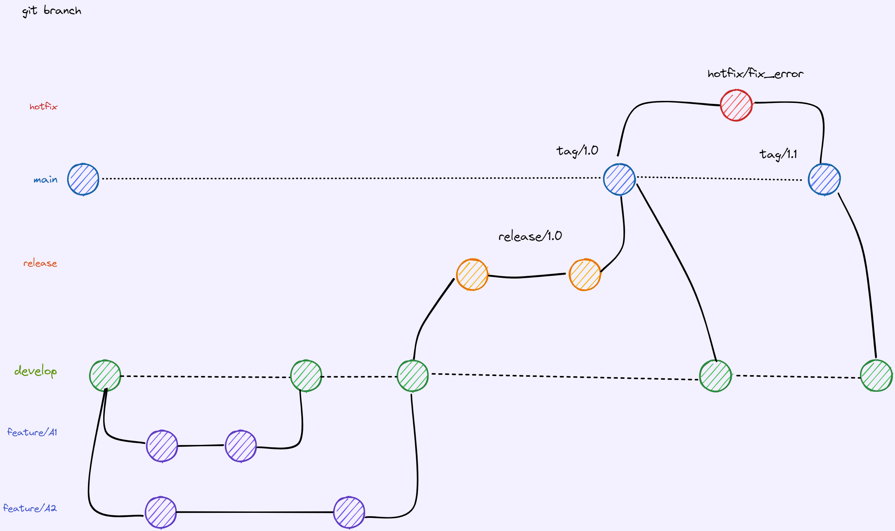

# Git Flow

El flujo de trabajo debe ser el siguiente:

>Nota: siempre que hagamos una pull request, usaremos la estrategia "merge" y "fast-forward" y olvidamos hacer un Rebase. La razón es que el rebase elimina las ramas y crea una sola rama con una sola línea de trabajo. Es importante poder seguir siempre el origen de los cambios, quién y cuándo se han hecho los cambios.

1. A partir de la rama "develop" creamos la rama feature/MI_TAREA.

2. Pull Request contra Develop

    Una vez la tarea está lista, hay que hacer una **Pull Request** contra *develop*, que es nuestra rama "principal". En develop solo puede haber código que esté preparado para ser enviado a producción en cualquier momento. Hacemos la pull request usando la estrategia "merge".

3. Cuando ya se prepara una release para enviar a producción, con los cambios de develop se crea una nueva rama que se llamará:

      **release/v1.1**

    Esta release/v1.1 se puede probar contra un entorno de preproducción. En esta rama se pueden hacer cambios para arreglar pequeñas partes del código.

4. Se hace una Pull Request contra main, con estrategia "merge". La finalidad es tener en la rama "main" todos los commits pertinentes de cambios así como los orígenes.

5. Si hemos modificado la release/v1.1, hay que hacer un merge de "main" a "develop", para incorporar los cambios con la estrategia **Merge**.

6. En el futuro se pueden hacer cambios directamente en la rama "main" con un hotfix, arreglos urgentes sobre producción:

    **hotfix/NOMBRE_TAREA**

    Al acabar el hotfix, hay que hacer una PR de main a develop. 
