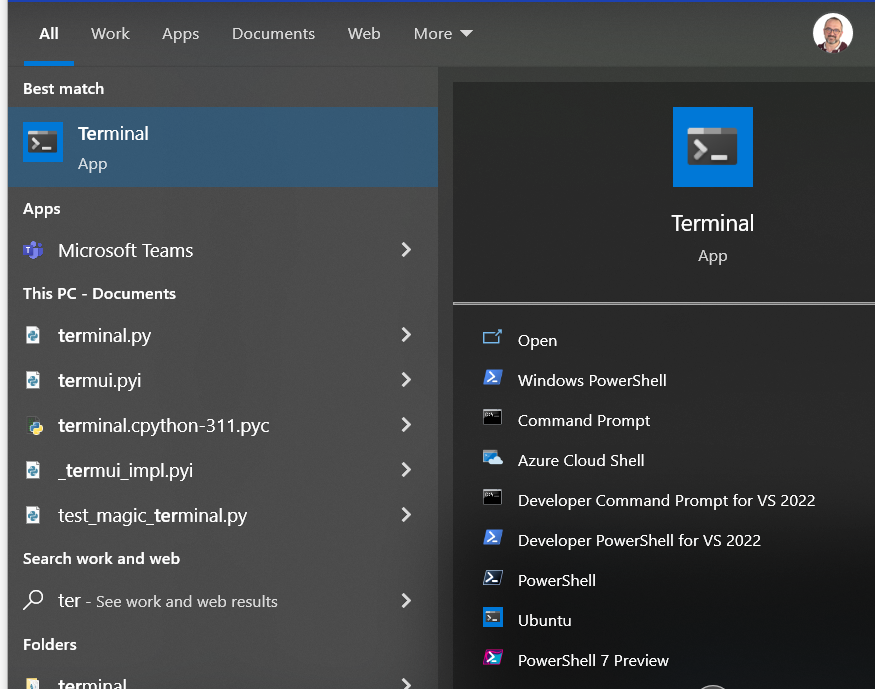
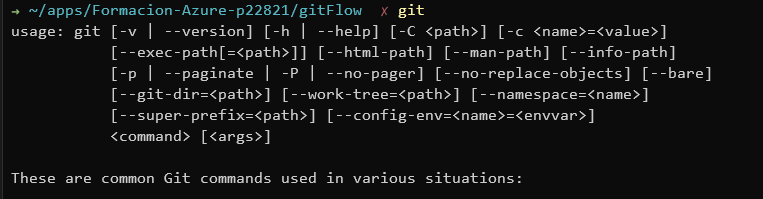

# Formación GIT

## Objetivos formación

1. Ser capaz de hacer un proyecto end-to-end sobre git, de acuerdo a la forma de trabajo de Bismart
2. Conocer funcionamiento básico de GIT en cualquier proyecto
3. Conocer la herramienta de Visual Studio Code
4. Conocer la como configurar git en nuestra máquina local: .gitignore, .gitconfig, ...

---
## Índice   

6h de formación

* [Session 1](./sesion1.md) (2h)
    * Qué sabemos de Git? 
    * Presentació básica de GIT
    * Autenticatión con GIT + Devops
    * Git Training online
    * Git flow

* [Sessión 2](./sesion2.md) (2h)
    * Labs con proyecto SQL

    
* [Sesión 3](./sesion3.md) (2h)
    * Labs con proyecto Datafactory
---
## Criterios de evaluación

La evaluación consiste en 3 items:

* Asistir a un 80% de la formación
* Tener una actitud despierta y activa
* Al finalizar, se pasará un test sobre Kahoot. Se deben acertar al menos el 50% de las preguntas. 
* Tener los "entregables" de los ejercicios hechos y que se pueda mostrar el resultado. 

---
## Preconfiguración antes de la formación

* [Instalar la terminal de windows](https://www.bing.com/ck/a?!&&p=65b0d4bb03042e9cJmltdHM9MTY4MjI5NDQwMCZpZ3VpZD0xNzFkMWYxNi04MmQ4LTZjZjgtMDU2OC0wZGQ0ODNjMjZkNjYmaW5zaWQ9NTQ3OA&ptn=3&hsh=3&fclid=171d1f16-82d8-6cf8-0568-0dd483c26d66&psq=install+window+terminal&u=a1bXMtd2luZG93cy1zdG9yZTovL3BkcC8_UHJvZHVjdElkPTlOMERYMjBISzcwMSZyZWZlcnJlcj1iaW5nd2Vic2VhcmNoJm9jaWQ9YmluZ3dlYnNlYXJjaA&ntb=1)
* [Instalar Git for windows](https://git-scm.com/download/win), o actualizar a la última versión  (2.40.0)
* [Instalar visual studio code](https://code.visualstudio.com/docs/?dv=win)

* [Instalar Visual Studio](https://visualstudio.microsoft.com/downloads/). La versión community es suficiente aunque en principio teneis licencia en Bimart para instalar la versión "Enterprise". Necesitareis instalar los componentes para crear proyectos de SQL.

Lo siguiente es probar si tenemos bien instalado Git, con el Path correcto y demás:

* Abrir un el terminal de windows y ejecutar "git" y deberíamos recibir algo como esto que no sea un error:

**Abrir terminal**

**Escribir "git"**
deberíais recibir un comando parecido a esto (si sale algo de "error" es que vamos mal)

>Nota: si teneis algún error, contactad conmigo (joan.teixido@bismart.com) y lo miramos **ANTES** de la formación

## Ejercicios previos
Si os aburrís, podeis entrar en https://learngitbranching.js.org/ y hacer algunos ejercicios... eso os convertirá en alumnos aventajados. 

## Requisitos avanzados

Para poder disfrutar de un terminal molón y bonito, instalar oh-my-posh:

[opcion 1](https://ohmyposh.dev/) Ofical site

[opcion 2](https://learn.microsoft.com/en-us/windows/terminal/tutorials/custom-prompt-setup) Instrucciones de microsoft

[opcion 3](https://dev.to/geekheaddd/beautify-windows-terminal-using-oh-my-guide-for-newbies-3m3k#:~:text=Oh%20my%20posh%20for%20Windows%20%282022%20guide%20for,the%20following%20oh-my-posh%20font%20install.%20...%20M%C3%A1s%20elementos) Un friki como otros...

