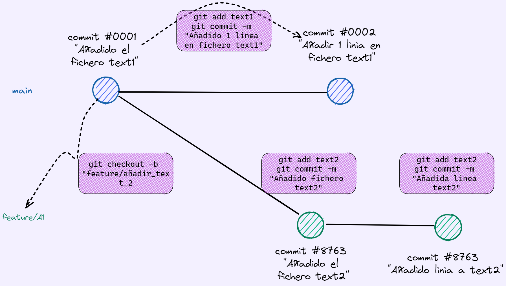
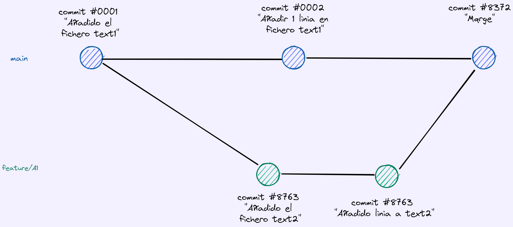

# Sesion 1 Git Flow en Bismart

## Presentación de la formación (0 - 10)

El objetivo de la formación es integrar en los proyectos de Bismart, una manera de trabajar sobre el código, sea SQL, Databricks, Datafactory o programas en Python. Queda fuera de la formación los proyectos centrados en Power BI, ya que al ser ficheros binarios grandes (un .pbix son distintos ficheros comprimidos y empaquetados bajo un solo fichero) no hemos definido en Bismart aún una manera práctica de trabajar con ellos. 

Con esta formación, pretendemos que todos los proyectos de Bismart adapten esta forma de trabajar o variaciones sobre el flujo que vamos a desribir.

## Objetivos de la sesion 1

* Aprender los comandos básicos en git: pull, push, merge, status, branch, checkout
* Aprender como funciona git bajo Visual Studio Code

----
## Conceptos básicos (10-50)

>Notas privadas: Joan.. abre el link con tu cuenta y les compartes el kahoot: https://create.kahoot.it/details/c9318539-166c-4623-a3b0-23eed7339c08


Si haceis la formación a vuestro paso, provad esta URL para autoexaminaros:

https://kahoot.it/challenge/093d68ba-2dac-4f5c-bdf3-1b31a9dffb2a_1682348715648
PIN: 02361092
----
## Introduccion a git (50 - 80)

Tenemos powerpoint con una presentación básica sobre git:

[Abrir powerpoint](https://bismartbiss.sharepoint.com/:p:/r/Formacion/Documentos%20Formacion/FORMACI%C3%93N%20INTERNA%202019/Operaciones/Formaci%C3%B3n%20Repositorio%20Git/Introduccion%20GIT.pptx?d=wd8c23ca46ff84b609f3e013c436870dd&csf=1&web=1&e=iOWpCp) (necesitas usuario de Bismart) 

----

## Ejercicio 1: creacion de un propio repositorio

**El objetivo del ejercicio es familiarizarse con los comandos de git, tanto en consola como con Visual Studio Code.**

Git es un repositorio de código distribuído; en tu máquina puede funcionar sin necesidad de conectarte a ningú lugar central ni disponer de ninguna cuenta de ningún tipo. 

Para ello vamos a hacer algunos ejercicios básicos con el fin de entender el funcionamiento del flow básico con Git. 

1. Crear una carpeta en tu directorio donde tengas los proyectos, que **no** sea bajo una carpeta controlada por **onedrive**. Git genera dentro una carpeta ".git" que contiene los ficheros necesarios para su funcionamiento, con la historia de cada documento, por lo que es una carpeta con mucho moviento de datos continuo. Con cada cambio se va a guardar la versión actual y los cambios por lo que no es recomendable tener **onedrive** funcionando a todo trapo cada minuto. 

2. Ves a esa carpeta desde la terminal: puedes hacer click sobre la carpeta con el boton derecho y hacer click en "abrir con la terminal". O bien abre la consola, copia la ruta entera de tu carpeta y ejecuta: 


```powershell
cd C:\Users\joan.teixido\apps\myGit
````

3. En esta carpeta vacía, ejecutamos "git init". En ese momento esta carpeta tendrá una carpeta oculta llamada .git

A partir de aquí, por defecto, todos los ficheros y carpetas incluídos bajo esta carpeta que seleccionemos estarán "tracked" por git. 

4. Abrir el visual Studio Code en esta carpeta "myGit", con boton derecho sobre carpeta, o con la terminal escribiendo:  ```code .```

5. Crear un fichero cualquiera con algún texto. 
6. Ejecutar ```git add .``` para añadir todos los ficheros para preparar el commit 

7. y luego un git commit -m "MENSAJE_DEL_COMMIT", para hacer un commit con ese fichero (o los que hayamos añadido)

```
git commit -m "Añadido mi primer fichero al commit"
```

Si ahora ejecutamos por ejemplo, ```git log``` tendremos la lista de commits ejecutados de más nuevo a más viejo. Cada commit tiene un ID que lo identifica y continene los datos del cambio (letra *j* i *k* para hacer scroll, *q* para salir)


8. Vamos a crear una nueva rama:

``` 
git checkout -b mi_nueva_rama
```

Con el -b creamos la rama y movemos el HEAD a esa nueva rama.

9. Creamos otro fichero distinto y lo añadimos a un nuevo commit. 




10. Finalmente cambiamos de rama y volvemos a main con ```git checkout main```

11. Ahora ya no tenemos el nuevo fichero, ya que solo existe en la rama "mi_nueva_rama"

Ahora se trata de juntar las dos ramas:

```
git merge mi_nueva_rama
```

Como estamos en la rama "main" eso nos trae los cambios en "mi_nueva_rama" a main. 





12. Al final vamos a realizar exactamente los mismos pasos del ejercicio pero con Visual Studio Code.


## Ejercicio 2: lo mismo con Visual Studio Code

Repetir los pasos de antes con visual studio code. 


## Ejercicio 3: clonar
