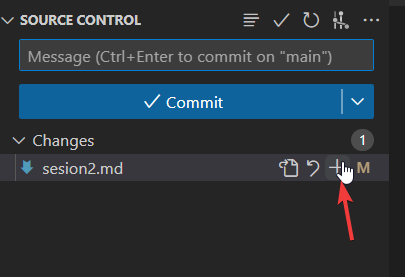
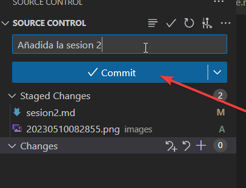
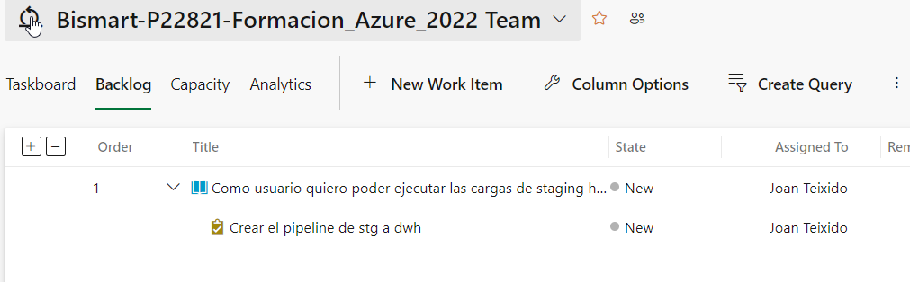
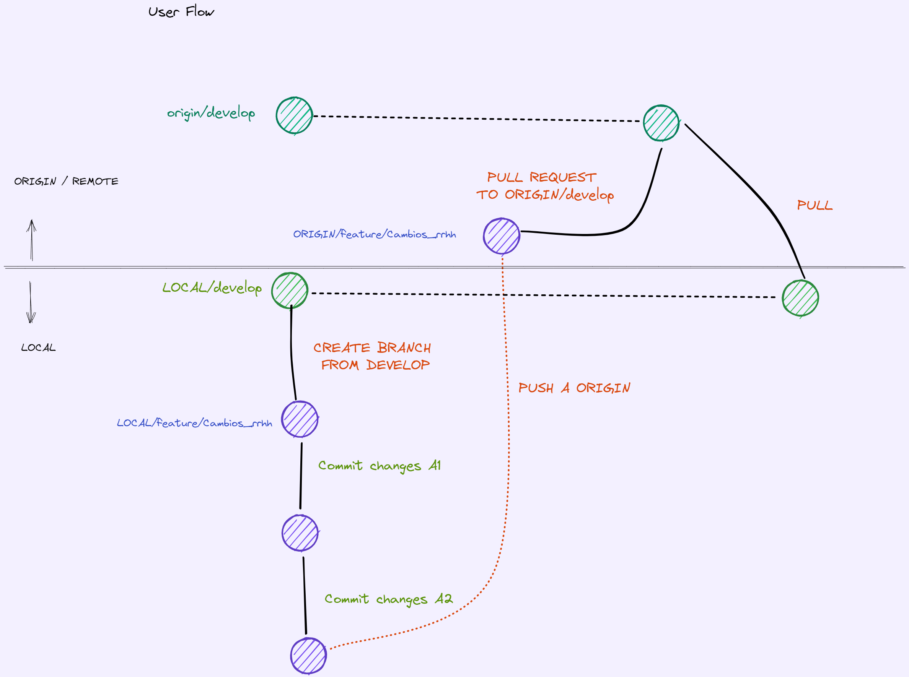
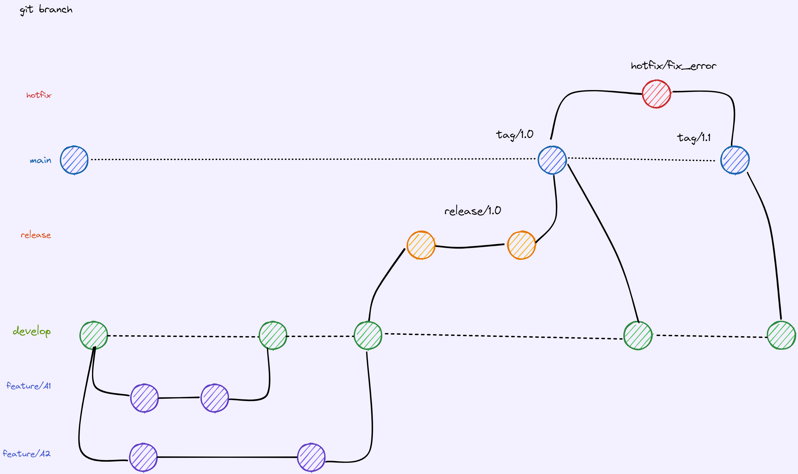
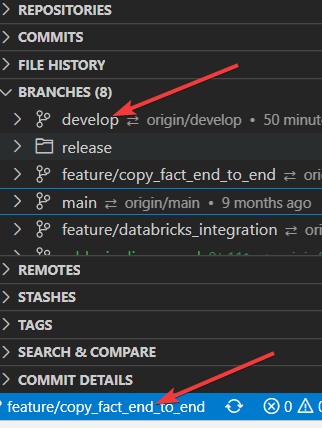
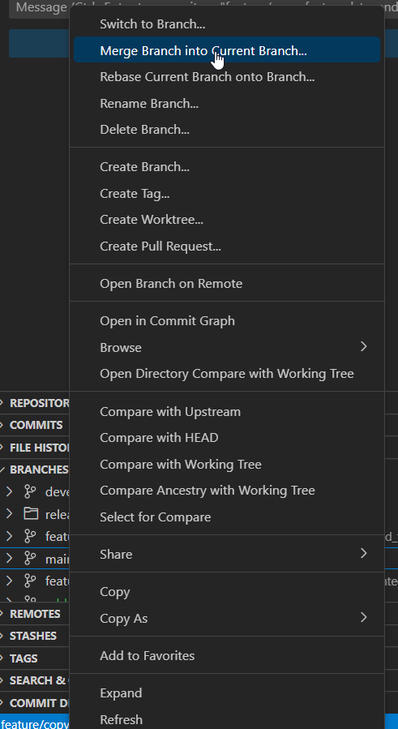

# Sesión 2 de gitflow en Bismart

En esta sesión vamos a ver como debería ser el flujo de trabajo en un proyecto, concretamente sobre un proyecto de Datafactory. 

Primero, es necesario tener claro el flujo entero, desde el primer desarrollo de una feature hasta el despliegue en producción. 


## Repaso de la sesión 1

* Aprendimos a crear ramas y movernos entre ramas en un repositorio local.

* ```git add NOMBRE_FICHERO|.``` -> añadimos un fichero o si ponemos "." todos los ficheros cambiados a "pendientes de commit", es decir, al hacer un commit vamos a añadir todos los ficheros que hemos añadido al "paquete"

  El equivalente en visual studio:




* ```git commit -m "MENSAJE"```  -> creamos un commit con un mensaje que es siempre obligatorio. 




* ```git push```: enviar al repositorio remoto nuestros cambios de nuestra rama
* ```git pull```: recibir los cambios del repositorio remoto
* ```git merge```: juntar las dos ramas

---

## Flujo de trabajo con Datafactory


Repaso de como sería de manera genérica el flujo de trabajo:

-> [git flow](gitflow.md)


Aplicamos este flujo de trabajo sobre un proyecto de Datafactory. 

Tenemos [3 entornos de Datafactory](https://portal.azure.com/#@bismart.com/resource/subscriptions/b49d990f-3e7e-4af9-9d9a-ce3872384a98/resourceGroups/rg-formacio-git/overview):
* [Desarrollo](https://adf.azure.com/en/authoring/pipeline/Copy%20all%20facts%20by%20year?factory=%2Fsubscriptions%2Fb49d990f-3e7e-4af9-9d9a-ce3872384a98%2FresourceGroups%2Frg-formacio-git%2Fproviders%2FMicrosoft.DataFactory%2Ffactories%2Fadf-formaciogit-2023-d1)
* [Integración / QA](https://adf.azure.com/en/authoring?factory=%2Fsubscriptions%2Fb49d990f-3e7e-4af9-9d9a-ce3872384a98%2FresourceGroups%2Frg-formacio-git%2Fproviders%2FMicrosoft.DataFactory%2Ffactories%2Fadf-formaciogit-2023-i1)
* [Producción](https://adf.azure.com/en/authoring?factory=%2Fsubscriptions%2Fb49d990f-3e7e-4af9-9d9a-ce3872384a98%2FresourceGroups%2Frg-formacio-git%2Fproviders%2FMicrosoft.DataFactory%2Ffactories%2Fadf-formaciogit-2023-p1)


Nuestra tarea consiste en crear un pipeline que cargue todos los datos segun la definición en devops:



[link a la tarea](https://dev.azure.com/bismartcom/Bismart-P22821-Formacion_Azure_2022/_sprints/backlog/Bismart-P22821-Formacion_Azure_2022%20Team/Bismart-P22821-Formacion_Azure_2022/Sprint%20Berenjenas)

---

El flujo debería ser:


* Entrar en el datafactory
* Crear la feature con el nombre de nuestra tarea. Las feature NO tienen el nombre de la persona sinó el nombre de lo que se está haciendo. 
* Se trabaja en desarrollo sobre el cambio
* Se crea una PULL REQUEST contra la rama de desarrollo (develop)
* Una vez aprobada, se pueden hacer pruebas de integración: o sea, pruebs que combinan otros elementos involucrados como un stored procedure o un Databricks. 
* Cuando se acaba el sprint, el periodo, la semana, lo que sea, genera una RELEASE con los cambios: release/v1.1
* Al crear una release, esta se despliega de manera automática en INTEGRACION para ser validad. 
* Si la release se aprueba, se lanza una PR contra producción con el mismo flow.


---



## Como resolver conflictos con Datafactory? 

Clonando el repositorio en vuestra máquina local y comparando las ramas. 

Supongamos en el caso anterior al hacer una PR de nuestra rama a develop, tenemos un conflicto:

1. Ir a la rama feature/MI_TAREA

2. Hacer un merge de la rama "develop" contra feature/MI_TAREA



*y con el boton derecho sobre la rama develop:*




(otro camino con código es ```git merge develop```)


3. Corregir el conflicto 
4. Hacer un commit con todos los cambios
5. Hacer push a nuestra rama en el remoto
6. Finalizar la Pull Request
