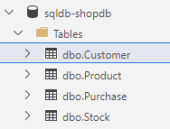

# Sesión 3 de gitflow en Bismart

En esta sesión vamos a ver el flujo de trabajo para un entorno SQL. 

El flujo es el mismo repetido en las otras sesiones:

-> [git flow](gitflow.md)

La especifidad de trabajar con Base de datos es que lo que se despliega es el fichero resultante de comparar nuestro proyecto SQL, en formato DacPac contra la Base de datos donde desplegamos. Por lo tanto se despliega y se ejecuta en la base de datos de integración o producción (o la que queramos) esa comparación. 

Como ya hemos repetido el mismo proceso varias veces, la propuesta es que cada uno realice algún cambio en la base de datos y podamos seguir todo el proceso de desarrollo - producción. En este ejemplo vamos a suponer que solo tenemos dos entornos: la base de datos de desarrollo sobre la que trabajamos a diario y la base de datos de producción. 

Aún así, despliegues hay 2: 
* Contra la base de datos de desarrollo - *rama develop* 
* Contra la de producción - *rama main*


La base de datos de test, tiene 4 tablas pero ningun dato:



La estructura es ultra senzilla, sin foreig keys y con algunos campos por cada tabla y se correspondería a una base de datos de operacions de una tienda online 

Las tareas a realizar son:

1. En la tabla customer, añadir un CreatedAt y un UpdatedAt con el valor actual de la fecha
2. En la tabla Product, añadir un CreatedAt y un UpdatedAt con el valor actual de la fecha
3. En la tabla Purchase, añadir un CreatedAt y un UpdatedAt con el valor actual de la fecha
4. En la table Stock, añadir el campo UpdatedAt
5. Modificar el campo Number del stock a un entero
6. Crear una vista con listado con datos del comprador, datos del producto y fecha
7. Crear una vista con el total de elementos con un stock inferior a 10

8. OTROS


## Ejercicios:

1. Clonar el proyecto de Base de datos: https://dev.azure.com/bismartcom/Bismart-P22821-Formacion_Azure_2022/_git/sqlProjectShopdb

2. Conectar a la base de datos de dev y de prod:
```
SQL Server DESARROLLO: sql-shopdb-d1.database.windows.net
Base de datos: sqldb-shopdb

SQL Server PRODUCCION: sql-shopdb-p1.database.windows.net
Base de datos: sqldb-shopdb

Login con vuestro user de Bismart, como MFA
```

3. Crear una rama a partir de develop y hacer la tarea concreta
4. Comparar schemas en visual studio para validar que solo hay los cambios esperados
5. PR contra develop

Al finalizar las tareas del sprint, hacer una PR contra main, despues de validar el schema compare. 


## Conclusiones

* Kahoot
* Próximos pasos para implementar en proyectos esta metodología


